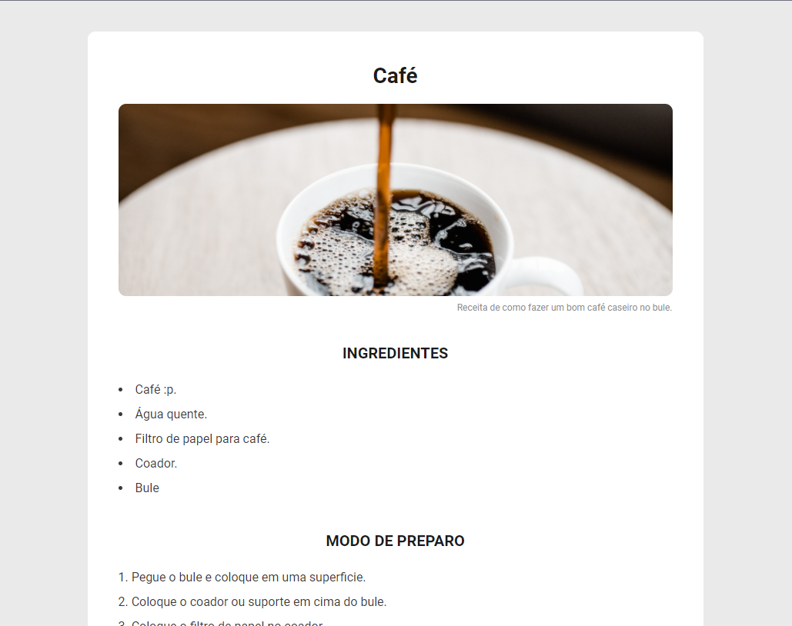

# ☕Página de Receita (Recipe Page)

🗯️ Esse projeto é um desafio proposto no treinamento Discover Rocketseat. Realizando a prática das tecnologias HTML5 e CSS3.

(This project is a challenge proposed in the Discover Rocketseat training. Performing the practice of HTML5 and CSS3 technologies.)

# 🌟 Demonstração (Demonstration)

  

[Visualizar Website - View Website](https://erich4hn.github.io/recipe-coffee-page/)

# 📝 Requisitos (Requirements)

- Navegador (Browser)

# 🎲 Tecnologias Utilizadas (Technologies Used)

- HTML5
- CSS3

# 👔 Créditos de Imagens (Credits of Images)

Imagem do café (Image of Coffee): [Pixabay](https://pixabay.com/pt/)

# 💡 Autor (Author)

<a href="https://github.com/erich4hn">Eric Hahn 👔</a>

